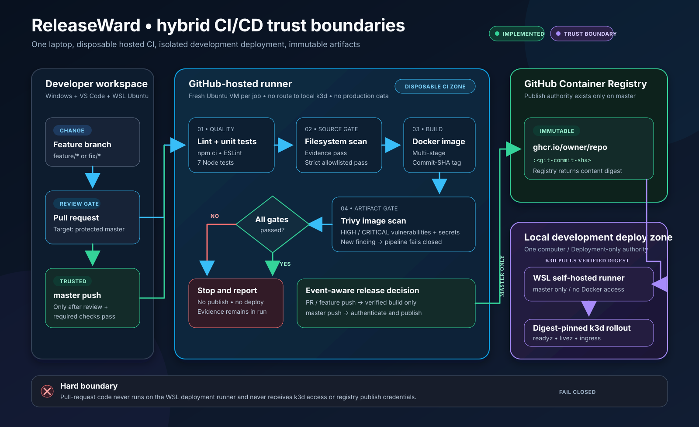
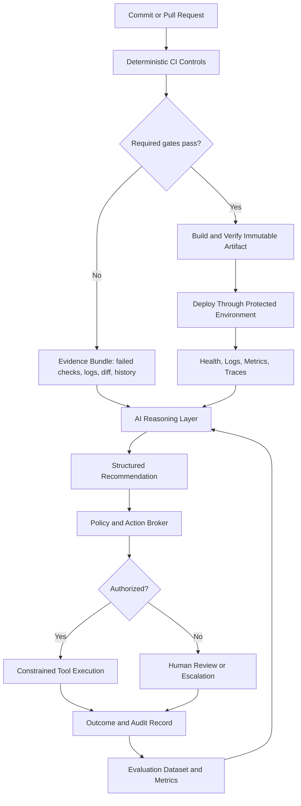
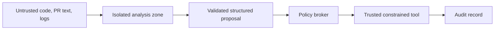

# ReleaseWard: AI-First CI/CD Design Vision

> **Status:** Future-state architecture and implementation roadmap  
> **Scope:** Independent learning and portfolio project  
> **Current implementation:** See [`TASKS.md`](./TASKS.md) and [`ARCHITECTURE.md`](./ARCHITECTURE.md) for the source of truth  
> **Core principle:** **AI interprets. Policy authorizes. Automation executes. Humans own the risk.**

ReleaseWard began as a self-hosted, AI-assisted delivery pipeline: test a change, scan it, build an immutable artifact, deploy it to Kubernetes, verify health, and produce a human-readable release summary.

This document extends that walking skeleton into a longer-term **AI-first CI/CD architecture**. “AI-first” does not mean replacing deterministic controls with a language model or giving an agent unrestricted production access. It means designing the delivery system so that trustworthy pipeline evidence can be interpreted by AI, evaluated against measurable outcomes, and gradually connected to constrained operational tools.

The intended progression is:

```text
Deterministic CI/CD
        ↓
Structured evidence and observability
        ↓
AI summaries and recommendations
        ↓
Measured performance in shadow mode
        ↓
Reviewable proposed actions
        ↓
Bounded, reversible automation
        ↓
Higher authority only when supported by evidence
```

---

## 1. Design Principles

### 1.1 Deterministic controls remain authoritative

The following controls should produce objective pass/fail results and must not depend on probabilistic model judgment:

- Compilation and build success
- Linting and formatting
- Unit, integration, contract, and smoke tests
- Dependency, secret, source, image, and infrastructure scanning
- Artifact identity, signing, provenance, and checksum verification
- Branch protection and required reviews
- Environment approval rules
- Deployment policy
- Health thresholds and rollback conditions
- Authentication and authorization

AI may explain these results, correlate them, prioritize them, or propose a response. It should not silently redefine whether a required gate passed.

### 1.2 AI operates from evidence

Every material AI conclusion should be traceable to pipeline evidence such as:

- Commit SHA and diff
- Changed files and affected components
- Test reports
- Scan reports
- Build metadata
- Artifact digest
- Deployment history
- Kubernetes rollout status
- Health checks
- Logs, metrics, and traces
- Previous incidents
- Approved exceptions
- Human review outcomes

A recommendation without supporting evidence is not an operational decision.

### 1.3 Authority is earned

AI capabilities should begin in read-only mode and gain authority only after they demonstrate acceptable performance on real, human-reviewed cases.

```text
Observe → Recommend → Prepare → Execute bounded actions → Guarded autonomy
```

Authority should be scoped independently for each use case. Strong performance at release-note generation does not prove that the same model should be permitted to roll back a deployment.

### 1.4 Least privilege applies to agents

An AI agent should never receive a broad combination of:

- Raw untrusted repository content
- Long-lived secrets
- Repository administration
- Unrestricted shell access
- Kubernetes administrator access
- Production database access
- Permission to waive its own controls

Each capability should be exposed as a narrow, auditable tool with an explicit schema and policy.

### 1.5 The pipeline must work without AI

Model outages, malformed output, rate limits, latency, or low confidence must not break the deterministic delivery path.

The safe fallback is one of:

- Continue without the optional AI output
- Stop at a human approval boundary
- Route the case for manual review
- Use a deterministic runbook

### 1.6 Every action is attributable and reversible where possible

The system should record:

- What evidence was provided
- Which model and prompt version were used
- What conclusion was produced
- Which tool was requested
- Which policy allowed or rejected it
- Whether a human approved it
- What was executed
- What happened afterward

High-authority actions should prefer reversible operations such as pausing a canary, rerunning one job, opening a remediation pull request, or rolling back to a previously verified artifact.

---

## 2. Current ReleaseWard Foundation

ReleaseWard already defines a practical deterministic walking skeleton:



```text
Commit / pull request
    → lint and unit tests
    → repository security scan
    → Docker build
    → image security scan
    → immutable image published by commit SHA
    → self-hosted deployment to k3d
    → readiness, liveness, and smoke verification
    → AI-generated release summary
```

The implemented portion now runs lint/test, repository scanning, Docker build, and final-image scanning on disposable GitHub-hosted runners. Pull requests stop after verification; only a successful `master` push publishes the immutable commit-SHA image to GHCR and records its digest. The self-hosted WSL runner remains a planned deployment-only boundary and will not execute pull-request code.

The project separates the application from the pipeline and intentionally keeps the application small. That is the right boundary: **the delivery system is the product being explored.**

This design vision should not be interpreted as claiming that every component below is already implemented. Current reality remains documented in:

- [`TASKS.md`](./TASKS.md)
- [`ARCHITECTURE.md`](./ARCHITECTURE.md)
- [`DECISIONS.md`](./DECISIONS.md)
- [`KNOWN_ISSUES.md`](./KNOWN_ISSUES.md)

---

## 3. Target Architecture



The architecture is divided into five cooperating planes.

### 3.1 Deterministic control plane

Responsibilities:

- Trigger workflows
- Run required quality and security gates
- Build and identify artifacts
- Enforce repository and environment protections
- Deploy approved artifacts
- Verify health
- Trigger rollback thresholds
- Produce machine-readable evidence

This plane decides whether objective policy requirements are met.

### 3.2 Evidence and observability plane

Responsibilities:

- Normalize test, scan, build, deployment, and runtime events
- Correlate events by repository, commit SHA, artifact digest, release, and environment
- Store historical outcomes
- Expose evidence to AI without exposing unnecessary secrets
- Support both machine analysis and human inspection

This is the foundation for trustworthy AI. Without consistent evidence, the model can only produce plausible text.

### 3.3 AI reasoning plane

Responsibilities:

- Explain failures
- Correlate related evidence
- Classify likely causes
- Assess release risk
- Generate release summaries
- Recommend remediation
- Draft pull requests, issues, and incident updates
- Identify uncertainty and missing evidence

The output must be structured and validated before it can influence an operational action.

### 3.4 Policy and action plane

Responsibilities:

- Validate model output against a schema
- Authenticate the requesting agent
- Check environment and repository scope
- Apply allowlists, rate limits, retry limits, and confidence requirements
- Require approval when appropriate
- Execute only defined tools
- Reject attempts to bypass controls
- Record the decision

This plane converts an AI suggestion into a governed operation.

### 3.5 Human oversight and evaluation plane

Responsibilities:

- Review consequential recommendations
- Accept, reject, or modify proposed actions
- Define risk tolerances
- Approve exceptions
- Label outcomes for evaluation
- Promote or reduce AI authority
- Review incidents and unsafe attempts

Humans remain responsible for the risk policy even when execution is automated.

---

## 4. Evidence Bundle

Each pipeline run should produce a normalized evidence bundle. The model should receive this bundle instead of being asked to infer state from thousands of unstructured log lines.

Example:

```json
{
  "schema_version": "1.0",
  "pipeline_run": {
    "run_id": "29853945890",
    "repository": "RafaelEstrella05/releaseward",
    "commit_sha": "95ae30f...",
    "trigger": "pull_request",
    "branch": "feature/example",
    "started_at": "2026-07-25T15:10:00Z",
    "completed_at": "2026-07-25T15:11:12Z"
  },
  "change": {
    "files_changed": 4,
    "components": ["app", "k8s"],
    "database_migration": false,
    "dependency_change": true
  },
  "checks": [
    {
      "name": "unit-tests",
      "status": "passed",
      "total": 7,
      "failed": 0,
      "report_uri": "artifact://test-results.json"
    },
    {
      "name": "trivy-filesystem",
      "status": "failed",
      "severity_counts": {
        "critical": 0,
        "high": 1,
        "medium": 2
      },
      "report_uri": "artifact://trivy-fs.json"
    }
  ],
  "artifact": null,
  "deployment": null,
  "approved_exceptions": [],
  "historical_context": {
    "similar_failures": 2,
    "previous_successful_commit": "8bc52d1..."
  }
}
```

### Evidence requirements

- Use stable identifiers rather than display names alone.
- Include timestamps in UTC.
- Preserve raw evidence as an artifact.
- Give the model only the fields needed for the task.
- Redact secrets and sensitive values before inference.
- Treat repository text, logs, issue content, and pull-request descriptions as untrusted data.
- Record the exact evidence bundle hash used for each AI decision.

---

## 5. Structured AI Decision Contract

Free-form text is useful for humans but unsafe as the only machine interface. The AI should return a validated structure.

```json
{
  "schema_version": "1.0",
  "decision_id": "ai-dec-01J...",
  "use_case": "pipeline_failure_triage",
  "summary": "The filesystem scan found one high-severity vulnerable dependency.",
  "classification": "dependency_vulnerability",
  "confidence": 0.94,
  "evidence": [
    {
      "source": "check:trivy-filesystem",
      "claim": "One high-severity finding is present."
    },
    {
      "source": "artifact://trivy-fs.json#/Results/0/Vulnerabilities/0",
      "claim": "The finding affects a direct application dependency."
    }
  ],
  "uncertainties": [
    "Runtime exploitability has not been tested."
  ],
  "recommended_action": {
    "tool": "create_remediation_issue",
    "arguments": {
      "severity": "high",
      "component": "app",
      "finding_id": "CVE-EXAMPLE"
    }
  },
  "requires_human_approval": false
}
```

Validation should reject output when:

- Required fields are absent
- The requested tool is not allowlisted
- Evidence references do not exist
- The model requests a permission outside its role
- Confidence is below the configured threshold
- The use case requires human approval
- The model attempts to waive a deterministic gate

---

## 6. AI Authority Ladder

| Level | Mode | Allowed behavior | Example |
|---|---|---|---|
| **0** | Observe | Read evidence and produce an explanation | Summarize a failed workflow |
| **1** | Recommend | Suggest a next action with evidence | Recommend a single retry |
| **2** | Prepare | Create reviewable work without applying it | Draft an issue or remediation PR |
| **3** | Execute bounded actions | Perform low-risk, reversible, rate-limited actions | Rerun one failed job |
| **4** | Guarded operational action | Change deployment state through policy and approvals | Pause a canary or invoke an approved rollback |
| **5** | Broad autonomous authority | Merge, waive gates, or deploy without review | Not a near-term project goal |

### Promotion requirements

A use case should move to a higher level only when:

- A representative evaluation set exists
- Success and failure metrics are defined
- Performance meets an agreed threshold
- Unsafe failure modes have been tested
- Tool permissions are constrained
- Audit records are complete
- A rollback or human takeover path exists
- The higher authority provides measurable value

Authority can also be reduced when performance degrades.

---

## 7. Initial AI Use Cases

### 7.1 Release summary

**Inputs**

- Commit diff
- Commit messages
- Test and scan results
- Artifact digest
- Deployment result
- Approved exceptions

**Outputs**

- What changed
- Which components are affected
- Quality and security status
- Deployment status
- Known risks
- Rollback artifact
- Evidence-linked stakeholder summary

**Initial authority:** Level 0  
**Failure behavior:** Pipeline remains valid; summary is marked unavailable.

### 7.2 Pipeline failure triage

**Inputs**

- Failed job and step
- Relevant logs
- Changed files
- Runner health
- Similar historical failures
- Retry history

**Outputs**

- Failure category
- Likely cause
- Supporting evidence
- Confidence
- Recommended next diagnostic or action
- Escalation condition

**Initial authority:** Level 1  
**Possible later authority:** One bounded retry for a proven flaky failure class.

### 7.3 Security finding explanation

**Inputs**

- Scanner output
- Dependency relationship
- Changed files
- Runtime context
- Existing exceptions

**Outputs**

- Human-readable explanation
- Likely affected component
- Suggested remediation
- Missing evidence
- Draft exception request, if needed

**Initial authority:** Level 1 or 2  
**Prohibited:** Silently waiving a required security gate.

### 7.4 Remediation pull request

**Inputs**

- Confirmed defect
- Relevant source files
- Test expectations
- Repository development instructions

**Outputs**

- Minimal patch
- Added or updated tests
- Explanation of the change
- Explicit limitations

**Initial authority:** Level 2  
**Required controls:** Normal CI, review, branch protection, and merge policy remain unchanged.

### 7.5 Deployment observation

**Inputs**

- Kubernetes rollout state
- Readiness and liveness results
- Error rate
- Latency
- Pod restarts
- Logs and traces
- Previous deployment baseline

**Outputs**

- Correlated health summary
- Suspected regression
- Recommendation to continue, pause, or roll back
- Evidence and uncertainty

**Initial authority:** Level 1  
**Possible later authority:** Pause a rollout. Deterministic thresholds should remain the primary automatic rollback mechanism.

### 7.6 Incident assistant

**Inputs**

- Alerts
- Recent releases
- Logs, metrics, and traces
- Known dependencies
- Human updates

**Outputs**

- Timeline
- Suspected affected components
- Suggested diagnostic steps
- Draft status update
- Missing information

**Initial authority:** Level 0 or 1  
**Possible later authority:** Create an incident issue and run approved read-only diagnostics.

---

## 8. MCP and the Tool Boundary

Model Context Protocol can provide a standardized way to expose pipeline context and tools to an AI client. It is one possible implementation of the action boundary, not the authority system itself.

MCP can define tools such as:

```text
get_pipeline_run(run_id)
get_test_report(run_id, check_name)
get_scan_findings(run_id, severity)
get_deployment_status(release_id)
get_runtime_health(release_id, window_minutes)

create_release_summary(run_id)
create_remediation_issue(finding_id)
request_job_retry(run_id, job_id)
request_deployment_approval(release_id)
pause_rollout(release_id)
request_rollback(release_id, artifact_digest)
```

### Important boundary

MCP standardizes how context and tools are exposed. It does **not** automatically provide:

- Safe permissions
- Correct policy
- Prompt-injection resistance
- Environment isolation
- Human approval
- Rate limiting
- Audit completeness
- Artifact trust

The MCP server or internal API layer must still enforce authorization and policy.

### Recommended tool design

Each tool should have:

- One narrow purpose
- Typed arguments
- Explicit repository and environment scope
- Idempotency where possible
- Rate and retry limits
- Dry-run support
- Approval requirements
- Structured output
- Complete audit logging

Avoid generic tools such as:

```text
run_shell(command)
kubectl(args)
call_api(url, body)
write_file(path, content)
```

Prefer constrained tools such as:

```text
rerun_failed_job_once(run_id, job_id)
pause_active_canary(release_id)
rollback_to_verified_artifact(release_id, artifact_digest)
```

---

## 9. Policy and Action Broker

The policy broker is the gate between AI reasoning and execution.

Example policy:

```yaml
policies:
  - id: retry-known-flake
    use_case: pipeline_failure_triage
    tool: rerun_failed_job_once
    environments: [ci]
    requirements:
      minimum_confidence: 0.90
      failure_classification: test_flake
      prior_matching_cases: 20
      measured_precision: 0.95
      maximum_retries_per_job: 1
      deterministic_gate_waiver: false
      human_approval: false

  - id: pause-canary
    use_case: deployment_observation
    tool: pause_active_canary
    environments: [staging, production]
    requirements:
      minimum_confidence: 0.95
      evidence_sources:
        - rollout_status
        - error_rate
        - baseline_comparison
      human_approval:
        staging: false
        production: true
      maximum_actions_per_release: 1
```

The broker should make the final authorization decision using deterministic policy. The model may recommend an action but must not decide whether it is permitted.

---

## 10. Evaluation Framework

The [`evals/`](./evals/) directory should become the evidence base for increasing AI authority.

Suggested layout:

```text
evals/
├── README.md
├── datasets/
│   ├── failure-triage.jsonl
│   ├── release-summary.jsonl
│   ├── security-explanation.jsonl
│   └── deployment-observation.jsonl
├── schemas/
│   ├── evidence-bundle.schema.json
│   └── ai-decision.schema.json
├── expected/
│   └── reviewed-outcomes.jsonl
├── prompts/
│   ├── failure-triage-v1.md
│   └── release-summary-v1.md
├── results/
│   └── .gitkeep
└── scripts/
    ├── run-evals.js
    └── score-results.js
```

### 10.1 Evaluation data sources

Start with controlled cases:

- Known unit-test failure
- Lint failure
- Intentional vulnerable dependency
- Intentional secret fixture
- Docker build failure
- Readiness failure
- Image pull failure
- Kubernetes rollout timeout
- Healthy release
- Repeated flaky failure
- Prompt-injection text placed in a log or PR description

Then add real pipeline runs after human review.

### 10.2 Core metrics

#### Correctness

- Failure classification accuracy
- Root-cause precision and recall
- Security explanation accuracy
- Release-summary factual accuracy
- Evidence citation validity
- Missing-critical-information rate
- Unsupported-claim rate

#### Operational value

- Mean time to diagnosis
- Human review time saved
- Recommendation acceptance rate
- Successful remediation rate
- Reduction in repeated manual steps
- Change in recovery time

#### Safety

- Unsafe tool-request rate
- Unauthorized-action attempt rate
- Prompt-injection success rate
- Secret-exposure rate
- Gate-waiver attempt rate
- Human override rate
- Incorrect autonomous-action rate

#### Reliability and cost

- Structured-output validation rate
- Model timeout rate
- Retry rate
- Median and p95 latency
- Tokens per decision
- Cost per useful accepted recommendation

### 10.3 Human review labels

Each recommendation can be labeled:

```json
{
  "decision_id": "ai-dec-01J...",
  "review": {
    "verdict": "accepted_with_changes",
    "classification_correct": true,
    "evidence_complete": false,
    "action_safe": true,
    "action_useful": true,
    "notes": "Correct diagnosis, but it omitted the runner-health evidence."
  },
  "actual_outcome": {
    "action_taken": "manual_retry",
    "resolved": true,
    "incident_created": false
  }
}
```

These labels create the human-interpretable metrics required before increasing authority.

---

## 11. Shadow Mode

Before an agent receives operational authority, run it in **shadow mode**.

In shadow mode:

1. The normal deterministic and human process continues.
2. The agent analyzes the same evidence.
3. Its recommendation is recorded but not executed.
4. A human records what they actually decided.
5. The two are compared.
6. Accuracy, safety, usefulness, latency, and failure modes are measured.

Example promotion rule:

```text
A failure-triage agent may request one automatic retry only after:

- at least 100 reviewed cases,
- ≥95% precision for the specific flaky-test classification,
- zero successful gate-bypass or secret-exposure cases,
- a maximum of one retry per job,
- automatic escalation when the retry fails,
- and a complete audit record.
```

The threshold is use-case-specific, not a universal score.

---

## 12. Security and Trust Boundaries

### 12.1 Untrusted inputs

Treat all of the following as potentially hostile:

- Source code
- Comments
- Commit messages
- Pull-request descriptions
- Issue text
- Test names
- Log output
- Dependency metadata
- Scanner descriptions
- External alerts
- Generated artifacts

A malicious input may attempt to instruct the model to reveal secrets, ignore policy, invoke a tool, or alter the release.

### 12.2 Separate analysis from execution



**Analysis zone**

- No production secrets
- No unrestricted shell
- No deployment credentials
- Read-only evidence access
- Network egress restricted where practical
- Output limited to a schema

**Execution zone**

- Does not ingest raw arbitrary repository text
- Receives a validated proposal
- Uses short-lived credentials
- Executes allowlisted operations
- Applies environment policy
- Requires approval when configured
- Records all actions

### 12.3 Self-hosted runner boundary

The current ReleaseWard design uses a self-hosted runner so GitHub Actions can reach a local k3d cluster. This is useful for the project, but it creates an important trust boundary.

For a safer design:

- Do not execute untrusted pull-request code on the privileged deployment runner.
- Separate CI runners from deployment runners.
- Limit which workflows and branches may use the deployment runner.
- Prefer ephemeral or clean runner environments when practical.
- Use explicit runner labels and repository/workflow restrictions.
- Avoid long-lived secrets on the runner.
- Use short-lived identity such as OIDC when integrating with cloud systems.
- Give the deployment identity only the permissions required for the target environment.
- Never expose cluster-admin access to a general AI analysis job.

### 12.4 Supply-chain protection

Future production hardening should include:

- Immutable image tags based on commit SHA
- Deployment by digest where possible
- Software bill of materials
- Build provenance and artifact attestations
- Signed artifacts
- Pinned third-party GitHub Actions
- Minimal `GITHUB_TOKEN` permissions
- Protected environments
- Approved release workflows
- Dependency and image scanning
- Secret scanning
- Audit retention

AI may summarize this evidence, but deterministic verification decides whether the artifact is trusted.

---

## 13. Implementation Roadmap for ReleaseWard

### Phase 0 — Complete the deterministic walking skeleton

**Goal:** Prove that the pipeline can build, verify, publish, deploy, and check a release without AI.

- [x] Add Trivy repository scan
- [x] Add Docker build
- [x] Add Trivy image scan
- [x] Publish immutable image by commit SHA
- [ ] Configure self-hosted deployment runner
- [ ] Deploy to k3d
- [ ] Verify rollout status
- [ ] Run readiness, liveness, and ingress smoke tests
- [ ] Record the deployed artifact digest
- [x] Separate untrusted CI from privileged deployment execution

**Exit condition:** AI can be removed and the full deterministic release path still works.

### Phase 1 — Generate a structured evidence bundle

**Goal:** Give both humans and AI one normalized record of the run.

- [ ] Export test results as JSON
- [ ] Export Trivy results as JSON or SARIF
- [ ] Capture changed files and components
- [ ] Capture image tag and digest
- [ ] Capture deployment and health results
- [ ] Correlate everything by run ID and commit SHA
- [ ] Upload the evidence bundle as an artifact
- [ ] Validate it against a JSON Schema

**Exit condition:** A reviewer can understand the release without manually opening every job log.

### Phase 2 — AI release summary in shadow mode

**Goal:** Add useful AI interpretation without operational authority.

- [ ] Read only the normalized evidence bundle and approved diff context
- [ ] Require structured AI output
- [ ] Render a human-readable pull-request comment
- [ ] Include evidence references and uncertainty
- [ ] Mark the stage non-blocking initially
- [ ] Store prompt, model, evidence hash, output, and latency
- [ ] Add reviewed examples to `evals/`

**Exit condition:** The summary is consistently factual enough to assist review.

### Phase 3 — Failure-triage evaluation harness

**Goal:** Measure whether AI can classify and explain pipeline failures.

- [ ] Build controlled failure fixtures
- [ ] Add expected classifications
- [ ] Score correctness and evidence coverage
- [ ] Add prompt-injection test cases
- [ ] Track unsupported claims and unsafe tool requests
- [ ] Compare AI recommendations with human decisions
- [ ] Publish evaluation results in the repository

**Exit condition:** Performance is visible through repeatable, human-interpretable metrics.

### Phase 4 — Read-only MCP or internal tool server

**Goal:** Standardize access to pipeline context without granting write authority.

Initial tools:

- [ ] `get_pipeline_run`
- [ ] `get_test_report`
- [ ] `get_scan_findings`
- [ ] `get_artifact_metadata`
- [ ] `get_deployment_status`
- [ ] `get_runtime_health`

Controls:

- [ ] Authentication
- [ ] Repository scope
- [ ] Structured schemas
- [ ] Rate limits
- [ ] Audit logs
- [ ] Input redaction
- [ ] No generic shell tool

**Exit condition:** The agent can retrieve needed evidence through a constrained interface.

### Phase 5 — Reviewable actions

**Goal:** Let AI prepare work while humans retain execution authority.

- [ ] Draft remediation issue
- [ ] Draft release note
- [ ] Draft workflow improvement
- [ ] Draft code or dependency update PR
- [ ] Require normal CI and code review
- [ ] Record accept/reject/edit outcomes

**Exit condition:** The agent saves meaningful work without bypassing existing controls.

### Phase 6 — Bounded low-risk execution

**Goal:** Permit one narrowly scoped, reversible action after evaluation.

Recommended first candidate:

```text
Rerun one failed job when:
- the failure is classified as a known flaky test,
- confidence exceeds the threshold,
- historical precision meets policy,
- no security gate failed,
- the job has not already been retried,
- and the retry is fully audited.
```

Other possible low-risk actions:

- Cancel a duplicate run
- Create or update an issue
- Request an approval
- Run a predefined read-only diagnostic
- Pause, but not promote, a canary

**Exit condition:** The action demonstrates measurable benefit with no unacceptable safety failures.

### Phase 7 — Guarded deployment operations

**Goal:** Explore policy-controlled operational authority.

- [ ] Canary deployment
- [ ] Baseline comparison
- [ ] Deterministic rollback thresholds
- [ ] AI deployment explanation
- [ ] Approval-gated pause or rollback request
- [ ] Verified rollback artifact
- [ ] Failure drill
- [ ] Human takeover path

**Exit condition:** The system can fail safely, explain itself, and recover through verified controls.

---

## 14. Suggested Repository Additions

```text
releaseward/
├── AI_FIRST_CICD.md
├── docs/
│   ├── ai/
│   │   ├── authority-model.md
│   │   ├── threat-model.md
│   │   ├── evidence-contract.md
│   │   └── policy-model.md
│   └── diagrams/
├── evals/
│   ├── README.md
│   ├── datasets/
│   ├── expected/
│   ├── prompts/
│   ├── results/
│   ├── schemas/
│   └── scripts/
├── policy/
│   ├── ai-actions.yaml
│   └── schemas/
├── tools/
│   └── pipeline-mcp/
└── .github/
    └── workflows/
        ├── ci.yml
        ├── release.yml
        ├── deploy.yml
        └── ai-eval.yml
```

This is a proposed future structure, not a requirement to create every folder immediately.

---

## 15. AI Decision Record

Each use case should have a lightweight decision record.

```markdown
# AI Use Case: Pipeline Failure Triage

## Purpose
Reduce time spent reading logs and identifying likely failure causes.

## Inputs
- Normalized failed-check evidence
- Relevant log excerpts
- Changed files
- Similar historical failures

## Excluded Inputs
- Secrets
- Production credentials
- Unrelated repository content

## Output
Validated `ai-decision.schema.json`.

## Current Authority
Level 1: recommendation only.

## Metrics
- Classification precision/recall
- Evidence-reference validity
- Unsupported-claim rate
- Human acceptance rate
- Time to diagnosis

## Promotion Requirement
Authority may move to Level 3 for one known flaky-test class after the
documented evaluation threshold is satisfied.

## Failure Behavior
No action. Route to human review.

## Owner
Project maintainer.
```

---

## 16. Definition of an AI-First Pipeline

ReleaseWard should call itself AI-first only when the following are true:

- The deterministic pipeline produces consistent, machine-readable evidence.
- AI performs a defined operational reasoning task, not merely decorative text generation.
- AI output is grounded in evidence and includes uncertainty.
- The model is evaluated on representative cases.
- Human review outcomes are recorded.
- Tool access is narrow and policy-controlled.
- AI cannot waive required gates.
- Authority is use-case-specific and earned through metrics.
- Unsafe inputs and prompt injection are tested.
- All consequential actions are attributable.
- The pipeline retains a safe non-AI fallback.
- The project clearly distinguishes what is implemented, partial, and planned.

---

## 17. Compressed Operating Model

```text
Baseline the deterministic system.
Collect trustworthy evidence.
Normalize it for humans and machines.
Run AI in shadow mode.
Measure accuracy, value, and unsafe behavior.
Let AI prepare reviewable work.
Grant one bounded action at a time.
Keep policy deterministic.
Keep permissions narrow.
Expand authority only when earned.
```

Or, in one sentence:

> **Unlimited reasoning can be explored; operational permissions must remain limited, measurable, and earned.**

---

## References

- [ReleaseWard repository](https://github.com/RafaelEstrella05/releaseward)
- [Model Context Protocol — Introduction](https://modelcontextprotocol.io/docs/getting-started/intro)
- [Model Context Protocol — Architecture](https://modelcontextprotocol.io/docs/learn/architecture)
- [Model Context Protocol — Security Best Practices](https://modelcontextprotocol.io/docs/tutorials/security/security_best_practices)
- [GitHub Actions — Secure Use Reference](https://docs.github.com/en/actions/reference/security/secure-use)
- [GitHub Actions — OpenID Connect](https://docs.github.com/en/actions/concepts/security/openid-connect)
- [NIST AI Risk Management Framework](https://www.nist.gov/itl/ai-risk-management-framework)
- [NIST AI RMF Core](https://airc.nist.gov/airmf-resources/airmf/5-sec-core/)
- [SLSA Provenance](https://slsa.dev/provenance)
