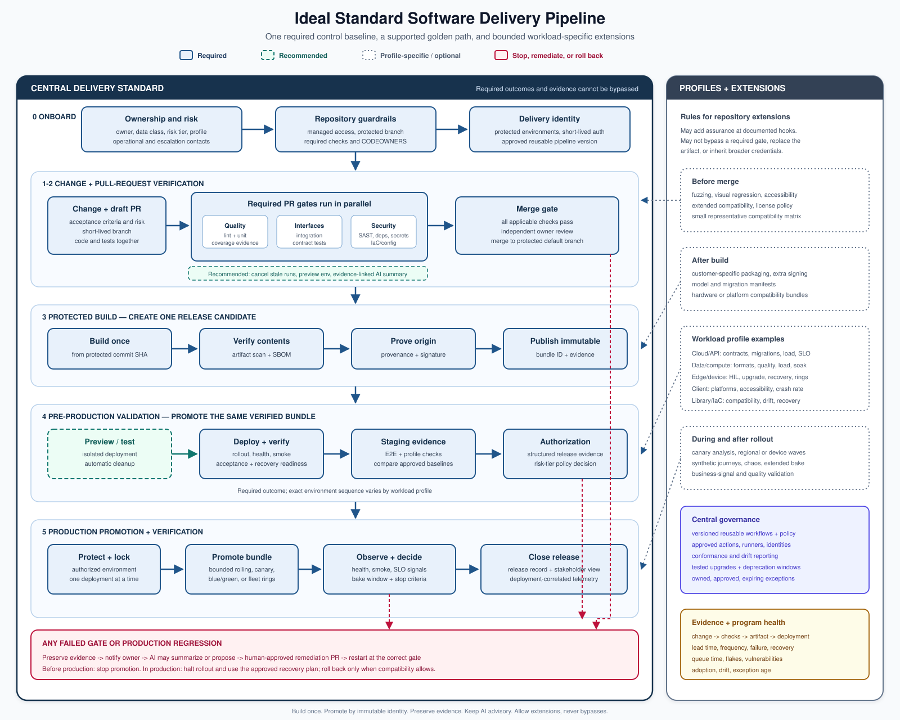

# Ideal Standard Software Delivery Flow

> **Status:** Proposed reusable reference standard for software delivery.
>
> **Goal:** Give every repository one safe, observable delivery path without forcing
> unlike workloads to use identical tests, tools, or deployment strategies.

ReleaseWard's current one-computer implementation is a deliberately smaller instance of this standard: disposable hosted runners verify pull requests, protected `master` publishes an immutable GHCR image, and a deployment-only WSL runner is the next planned promotion boundary. See the [current hybrid pipeline diagram](docs/releaseward-hybrid-pipeline.svg) and `ARCHITECTURE.md`; planned controls in this document must not be mistaken for already implemented features.

## The contract

The standard defines **required outcomes and evidence**, not one giant workflow that
every repository must copy. A central delivery platform provides mandatory gates as
versioned reusable workflows. Each repository selects a workload profile, configures
its implementation, and adds bounded extension jobs without bypassing required gates.

Build once, verify once, and promote the exact same immutable release bundle through
every environment. A failed gate stops promotion. A production regression invokes the
approved recovery plan; automatic rollback is used only when state and compatibility
make it safe.

## Control levels

| Level | Meaning | Deviation policy |
|---|---|---|
| **Required** | Non-negotiable control or evidence for every applicable repository | May be bypassed only through an audited, time-limited exception or emergency break-glass process |
| **Recommended** | The supported golden-path default | A repository may use a different implementation if the reason is documented and the required outcome is preserved |
| **Optional / profile-specific** | Extra assurance needed only for certain architectures or risk levels | Enabled by the repository's workload profile or configuration |

“Applicable” is important. A deployable service, a device image, a desktop client, and
a shared library do not release the same way. They still share the same governance,
source-control, evidence, artifact-integrity, and audit requirements.

## End-to-end flow

### 0. Repository onboarding

**Required**

1. Assign a service owner, operational contact, data classification, and risk tier.
2. Grant access through managed identity groups and least-privilege roles.
3. Protect the default branch: no direct pushes, required reviews, required status
   checks, and `CODEOWNERS` for sensitive paths.
4. Register allowed deployment environments, environment protection rules, and
   deployment identities.
5. Select an approved workload profile and the current major version of the central
   reusable pipeline.
6. Register where build evidence, release records, alerts, and ownership metadata live.

**Recommended**

- Generate repository settings and the minimal caller workflow from a template.
- Validate repository conformance continuously, not only during onboarding.

### 1. Change and pull request

**Required**

1. Record acceptance criteria and identify release risk.
2. Create a short-lived branch and open a draft pull request early.
3. Add or update tests with the implementation.
4. Keep credentials, production data, and generated artifacts out of source control.

Branching details may vary, but the protected default branch and pull-request gate
remain mandatory. Extra test sub-branches are not part of the golden path.

### 2. Pull-request verification

Run independent checks in parallel and fail fast.

**Required baseline**

- Reproducible dependency installation from a lockfile or equivalent.
- Language-appropriate source quality checks.
- Unit tests and changed-code coverage evidence.
- Integration or contract tests wherever the component has an interface.
- Secret, dependency, static-analysis, and infrastructure/configuration scanning where
  applicable.
- A machine-readable result for every required gate.
- Human review from the appropriate owners before merge.

**Recommended**

- Cancel superseded runs for the same pull request.
- Use change detection to skip provably unaffected expensive jobs.
- Create an isolated preview environment for deployable workloads.
- Add an AI-generated advisory summary that links every claim to pipeline evidence.

**Failure path**

Preserve logs and test evidence, notify the responsible owner, and return to the pull
request. AI may classify the failure and propose a patch, but it must not push directly
to a protected branch, approve its own work, or receive unrestricted credentials.

**Required execution boundary**

- Give each job only the workflow permissions it needs.
- Never expose deployment credentials or protected secrets to untrusted pull-request
  code.
- Isolate self-hosted jobs by trust level; prefer ephemeral runners for untrusted or
  high-risk workloads.
- Apply timeouts and bounded retries, and cancel superseded runs.

### 3. Protected build

After the pull request is approved and merged:

**Required**

1. Assemble the release bundle exactly once from the protected commit. Depending on
   the workload, it may contain one or more images/binaries, deployment manifests,
   model versions, migration metadata, and configuration schemas.
2. Identify every artifact and the bundle with immutable identities.
3. Scan the final artifacts, not only their source trees.
4. Generate an SBOM and build provenance.
5. Sign or attest the bundle using a trusted workload identity.
6. Publish it to the approved registry or package store.
7. Store the evidence bundle with the release candidate.

No later environment rebuilds the bundle. Environment differences are supplied as
versioned configuration, never by changing the binary or container.

### 4. Pre-production validation

**Required outcome**

Every release candidate is exercised in an environment representative enough to prove
deployment, configuration, compatibility, and health before production.

**Recommended golden path**

1. Promote the immutable bundle identity to an isolated test or preview environment.
2. Verify bundle identity, signatures, and attestations before deployment.
3. Wait for the orchestrator rollout to complete.
4. Run readiness, liveness, smoke, acceptance, and recovery-readiness checks.
5. Promote the same bundle to staging.
6. Run end-to-end, compatibility, security, and applicable workload-profile tests.
7. Validate backward/forward compatibility for APIs, events, schemas, migrations,
   configuration, models, devices, or protocols that change.
8. Compare latency, error rate, resource use, and workload-specific signals with an
   approved baseline.
9. Produce a structured release summary and risk assessment.
10. Apply the production authorization policy for the repository's risk tier.

Preview environments may be omitted for workloads that cannot support them, but the
equivalent verification evidence is still required.

### 5. Production promotion

**Required**

1. Authorize deployment through the protected production environment.
2. Promote the exact bundle identity that passed pre-production validation.
3. Prevent overlapping production deployments with an environment concurrency lock.
4. Use an approved rollout strategy with a bounded timeout.
5. Verify pre-deploy health, then rollout status, smoke tests, error rate, latency, and
   workload-specific service-level indicators during a defined bake window.
6. On success, publish the release record and update stakeholder and operational views.
7. On regression, halt the rollout and invoke the approved recovery plan. Restore the
   explicitly recorded last-known-good bundle only after checking state, schema, device,
   and protocol compatibility.
8. Preserve an audit trail connecting change, approvals, bundle, evidence, deployment,
   and outcome.

The risk profile determines whether production authorization is an independent human
approval or an automated policy decision. The authorization control itself is required.

### 6. Operate and learn

**Required**

- Continue observing the release for a defined bake period.
- Route alerts to the configured operational destination with the deployment identity
  attached.
- Track deployment frequency, lead time, change failure rate, recovery time, CI duration
  and queue time, flaky-test rate, rollback rate, escaped defects, vulnerability
  remediation time, adoption/drift, and exception count/age.
- Feed escaped defects and incidents back into tests, policy, and workload profiles.

Program metrics need targets, owners, and a review cadence. They measure the delivery
system and should not be used as individual performance rankings.

**Recommended**

- Compare releases against service-level objectives and historical baselines.
- Publish a plain-language release and health summary for non-pipeline stakeholders.
- Use AI to group failures, identify likely regressions, and draft follow-up work from
  trusted evidence.

## Non-negotiable standard

| Area | Required outcome | Required evidence | Implementation flexibility |
|---|---|---|---|
| Ownership | Every component and production alert has an accountable owner | Ownership metadata and escalation route | Escalation and on-call mechanism |
| Source control | Protected default branch; reviewed changes; no direct unreviewed production path | Pull request, reviews, required checks | Branch naming and review workflow |
| Access | Least privilege and managed identities | Access policy and audit events | Identity provider integration |
| Verification | Applicable quality and security gates pass before promotion | Machine-readable check results | Test frameworks and scan tools |
| Bundle integrity | One immutable, scanned, traceable release bundle is promoted | Bundle/artifact identities, SBOM, provenance, signature/attestation | Registry and packaging format |
| Secrets | No long-lived credentials embedded in code or artifacts | Secret scan and identity configuration | Secret manager |
| Deployment | Controlled promotion through protected environments | Deployment record and authorization | GitOps or push-based mechanism |
| Production safety | Bounded rollout, health verification, and tested recovery path | Post-deploy checks and rollback evidence | Rolling, canary, or blue/green strategy |
| Observability | A release can be tied to logs, metrics, traces, and alerts | Deployment markers and health signals | Observability platform |
| Auditability | Change-to-production lineage is queryable | Evidence bundle and release record | Storage/reporting implementation |
| Exceptions | Deviations are owned, risk-accepted, and expire | Approved exception record | Tracking system |

## Stop-ship policy

Running a scanner is not itself a standard; the central policy must define what blocks
promotion. At minimum:

- any required test or policy check that does not produce a valid result is a failure,
  not an implicit pass;
- confirmed exposed secrets, invalid artifact identity/signature, and prohibited
  licenses stop promotion;
- vulnerability gates use versioned severity, exploitability, reachability, and
  remediation-SLA rules rather than an undocumented severity number;
- flaky tests may be quarantined only with an owner, linked remediation work, expiration
  date, and visible loss of coverage;
- waivers name an accountable risk owner and compensating controls;
- thresholds and waiver authority are policy-as-code, reviewed, versioned, and reported
  centrally.

## Recommended golden-path controls

- Centrally maintained reusable workflows with small repository-level callers.
- Third-party actions pinned to reviewed immutable revisions.
- Short-lived workload identity instead of stored cloud credentials.
- Hermetic or reproducible builds with dependency caching that cannot alter outputs.
- Ephemeral preview environments with automatic cleanup.
- Staging configured from the same source as production.
- Structured release manifests and AI output validated against schemas.
- Automatic release notes generated from pull requests and deployment evidence.
- Progressive delivery for high-traffic or high-risk services.
- Feature flags and kill switches for changes that benefit from separating deployment
  from feature exposure.
- Policy conformance reported on a shared delivery dashboard.

## Workload profiles

Profiles add required checks for a class of workload. They cannot remove the common
baseline.

| Profile | Additional required or recommended checks |
|---|---|
| Cloud service / API | API contract tests, migration compatibility, load threshold, SLO checks, progressive rollout |
| High-throughput or compute-intensive processing | Representative format and platform matrix, correctness thresholds, startup and end-to-end latency, throughput, CPU/GPU/memory regression limits, representative soak test |
| Edge or device software | Cross-architecture builds, hardware-in-the-loop where available, upgrade/downgrade compatibility, interrupted-update recovery, staged fleet rings |
| Web or desktop client | Supported-platform matrix, visual regression, accessibility, packaging/signing, crash-rate guardrail |
| Shared library / SDK | Consumer compatibility matrix, semantic-version validation, package provenance, deprecation checks |
| Infrastructure / configuration | Policy-as-code, plan/diff review, drift detection, destructive-change approval, recovery validation |

### High-throughput processing profile details

Changes that touch a high-throughput or compute-intensive path should select a small
representative test matrix for pull requests and a broader scheduled or pre-release
matrix. The profile should cover:

- a versioned, licensed, sanitized representative test corpus; never unapproved
  production data;
- supported formats, protocols, payload sizes, platforms, runtime versions, GPU/driver
  versions, and hardware-acceleration paths;
- domain-appropriate quality and correctness thresholds instead of relying only on byte
  equality;
- corruption, ordering, synchronization, startup, end-to-end latency, throughput,
  reconnect, packet-loss, and jitter behavior;
- CPU, GPU, memory, thermal, bandwidth, and storage budgets;
- sustained soak and concurrency tests;
- privacy, retention, and redaction controls;
- staged rollout rings, interrupted-update recovery, and remote recovery for distributed
  or edge workloads.

## Optional extensions

Repositories may insert extension jobs at documented hooks:

- before merge: fuzzing, visual checks, extended compatibility, license policy;
- after artifact creation: additional signing, customer-specific packaging;
- before production: performance, chaos, soak, manual exploratory testing;
- during rollout: canary analysis, regional waves, device cohorts;
- after deployment: extended bake time, synthetic journeys, business-signal validation.

An extension may add a gate. It may not mark a failed mandatory gate as successful,
replace the release bundle, broaden credentials inherited from the central workflow, or
deploy around the protected environment.

## AI safety boundary

AI assistance is valuable for summarization, triage, anomaly explanation, release-note
drafting, and remediation proposals. Its authority remains bounded:

- Treat source, pull-request text, logs, and scanner output as untrusted prompt input.
- Redact secrets and sensitive customer data before model access.
- Use versioned prompts and schema-validated outputs.
- Log prompt version, model, inputs or evidence references, output, latency, and cost.
- Set time, token, retry, and tool-call limits.
- Require source links for factual claims about a pipeline failure or release.
- Do not send unapproved production data or sensitive operational data to a model.
- Never allow the model to approve its own change or production deployment.
- Auto-remediation writes only to an isolated branch or remediation pull request and
  must pass the normal pipeline.
- AI unavailability must have a documented fallback. Advisory AI should not become an
  accidental availability dependency for delivery.

## Exceptions and emergency changes

An exception record must include:

- the exact control being bypassed;
- business reason and affected repositories/environments;
- named owner and approver;
- risk assessment and compensating controls;
- start and expiration time;
- link to follow-up work;
- complete audit trail of its use.

Emergency break-glass access must be short-lived, strongly authenticated, visible to
designated operational contacts, and followed by retrospective review. It is not a
permanent alternative pipeline.

## Standard responsibilities and change management

A central delivery platform provides:

- reusable workflow and policy versions;
- the baseline control catalog and evidence schema;
- approved actions, runner images, and workload profiles;
- rollout of standard changes, migration guidance, and deprecation windows;
- conformance reporting and exception review.

Each repository defines:

- application tests and workload-profile configuration;
- service-specific thresholds and deployment readiness;
- operational response and rollback decisions;
- optional extensions and their maintenance.

Changes to the standard should be versioned, tested against representative repositories,
released with migration notes, and rolled out in rings. A breaking central-pipeline
change must never first appear through a failed production release.

## Definition of a compliant pipeline

A repository is compliant when:

1. its selected workload profile is declared and current;
2. all applicable required controls run through approved versions;
3. no extension can bypass or impersonate a mandatory gate;
4. the release bundle deployed to production is the bundle that was verified;
5. evidence connects the source change to the production outcome;
6. recovery is tested and bounded;
7. every active exception has an owner and future expiration date.
